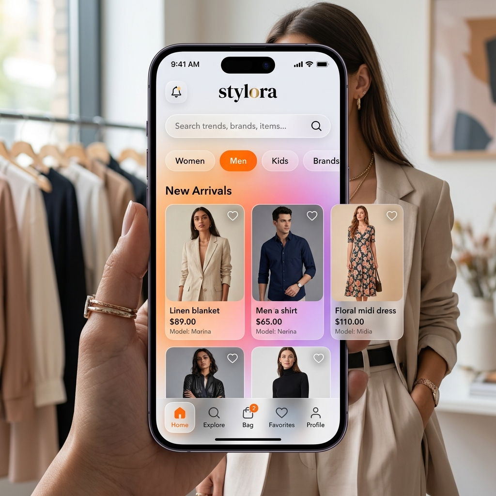
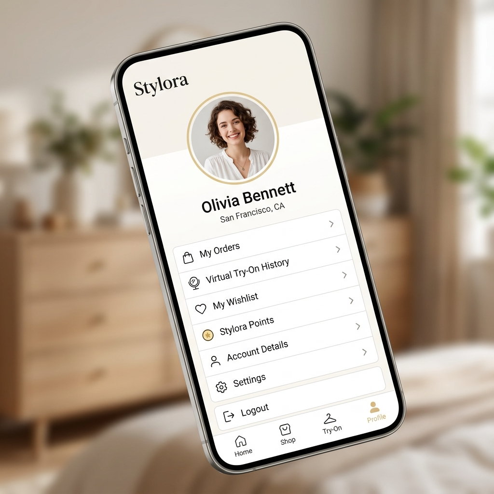

# Stylora - Fashion & AI Try-On App

## 1. Project Overview
Stylora is a modern fashion application dedicated to providing a unique and distinctive shopping experience. It relies on artificial intelligence technologies to enable users to "virtually try on" clothes to ensure they fit before purchasing.

## 2. Features
- **Smart and Seamless Shopping:** Browse products with the latest user interface designs (UI/UX).
- **Virtual Try-On:** Try clothes on your personal photo using the IDM-VTON artificial intelligence model.
- **Full User Customization:** Manage your personal account and review your virtual try-on history.
- **Real-time Updates:** Continuously follow the latest models and fashions in the system.

## 3. Tech Stack
- **Frontend:** Flutter & Dart
- **Database & Authentication:** Firebase (Firestore, Authentication, Storage)
- **AI Model:** Python (FastAPI, PyTorch, Diffusers, IDM-VTON)
- **Cloud Servers:** Google Colab / Local AI Server

## 4. Screenshots / UI
| Home | Category | Profile |
| :---: | :---: | :---: |
|  |  |  |

---

# Comprehensive Guide to Running the Stylora Project on Any Computer

This file contains the basic steps and requirements you will need to run the **Stylora** project, built with the **Flutter** framework, on any new computer.

---

## 1. Transfer Source Code
You first need to transfer this project folder to the new computer.
- **Best Method:** Push the project to a repository (like GitHub) and do a `git clone` on the new device.
- **Manual Method:** Copy the entire project folder to a portable drive (USB Flash) and transfer it.

## 2. Prerequisites
The new computer needs some essential software to recognize the programming language and be able to run the application:

### a) Flutter SDK
- Download the latest version from the [Official Flutter Website](https://docs.flutter.dev/get-started/install).
- Extract it and add it to your Environment Variables so the computer can read Flutter commands.

### b) Android Studio
- Download it from the [Android Developers Website](https://developer.android.com/studio).
- This program is crucial because it contains the Android SDK.
- Through it, you can create a virtual device (Emulator) to test the app on.

### c) Development Environment (VS Code)
- We prefer using [Visual Studio Code](https://code.visualstudio.com/).
- After installing it, go to the Extensions section and install two extensions: **Flutter** and **Dart**.

## 3. Database Files (Firebase)
This application relies on Google Firebase services for data storage.
- Ensure that the secret linking file **`google-services.json`** is present at this path: `android/app/google-services.json`.
- *(Note: If you are using GitHub, this file is usually ignored so it won't be stolen, so make sure to transfer it manually if you use GitHub).*

## 4. Running the Project for the First Time
After transferring the project and installing the software, follow these steps:

1. Open the project folder in **VS Code**.
2. Open the Terminal from within the editor.
3. Type the following command to download all libraries and tools the project depends on:
   ```bash
   flutter pub get
   ```
4. To ensure your device is completely ready and nothing is missing, run this magic command:
   ```bash
   flutter doctor
   ```
   *This command will scan your device. If you see green checkmarks (✔️) next to Flutter and Android Toolchain, it means you are good to go!*
5. Finally, run the Emulator or connect your phone, and press the Run button or type:
   ```bash
   flutter run
   ```

## 5. Clean Project to Reduce Size
If the project folder is taking up too much hard drive space and you want to reduce it before transferring or to free up space, run the following command in the Terminal:
```bash
flutter clean
```

### What happens after running this command?
- It will completely delete the `build` and `.dart_tool` folders, instantly restoring about 3.8 GB of hard drive space.
- When you run the app again (`flutter run` or `flutter build`), Flutter will automatically rebuild these files from scratch, starting at a very small size.

---
**Additional Notes:**
- If the new computer is a Mac and you want to run the app on iPhones (iOS), you will also need to install **Xcode** from the Apple App Store, and run the `pod install` command inside the `ios/` folder.

---

## 6. Setting Up and Running the AI Virtual Try-On Server
The application relies on an external server built with Python and the FastAPI framework to run the IDM-VTON AI model to virtually try on clothes. Because running this model locally requires a very powerful graphics card (Nvidia GPU with at least 12 GB VRAM), the best and easiest option is to run it for free on **Google Colab**.

### a) Running via Google Colab (Recommended for speed and being free)
1. Open [Google Colab](https://colab.research.google.com/).
2. Create a New Notebook.
3. Change the runtime type to **GPU T4** (by going to Runtime -> Change runtime type -> T4 GPU).
4. Copy and run the following code to install components and start the server:

```python
# 1. Clone repository and install core libraries
!git clone https://github.com/yisol/IDM-VTON.git
%cd IDM-VTON
# Replace the tryon_api.py file with the one in the project folder (IDM-VTON/tryon_api.py)
# You can upload it directly or copy it

!pip install -r requirements.txt
!pip install fastapi uvicorn websockets diffusers transformers accelerate pyngrok torch torchvision

# 2. Setup Ngrok to generate a public URL (Tunnel) to link the app to the server
# Make sure to register on ngrok to get a free Authtoken
from pyngrok import ngrok
NGROK_TOKEN = "place_your_token_here"
ngrok.set_auth_token(NGROK_TOKEN)
public_url = ngrok.connect(8001, bind_tls=True)
print("🔗 The public server link to put in the app is:")
print(public_url.public_url)

# 3. Start the server
!python tryon_api.py
```

### b) Local Execution (If you have a powerful PC with an Nvidia GPU)
1. Install **Python 3.10** or newer.
2. Ensure you have the **PyTorch** library installed that is compatible with your CUDA graphics card from the [Official PyTorch Website](https://pytorch.org/).
3. Open the command prompt inside the `IDM-VTON` folder and type the following commands to install libraries:
   ```bash
   pip install fastapi uvicorn websockets diffusers transformers accelerate pyngrok torch torchvision
   ```
4. Run the server locally:
   ```bash
   python tryon_api.py
   ```
   *The server will run on port 8001 by default (`http://localhost:8001`).*

---

## 7. Connecting the App with the New Server
After running the server and obtaining the Ngrok link (e.g., `https://xxxx-xx-xx.ngrok-free.dev`):
1. Open the **Stylora** app on your phone or emulator.
2. Log in with any account and go to the **Virtual Try-on** screen.
3. Tap the Settings icon (top right).
4. Enable the **Use Local Server** option.
5. Paste the Ngrok link into the address field (making sure to add `/tryon` at the end of the link, for example: `https://xxxx-xx-xx.ngrok-free.dev/tryon`).
6. Tap **Save Settings**.
7. The app is now fully connected and will display the step-by-step AI generation process live in real-time!
